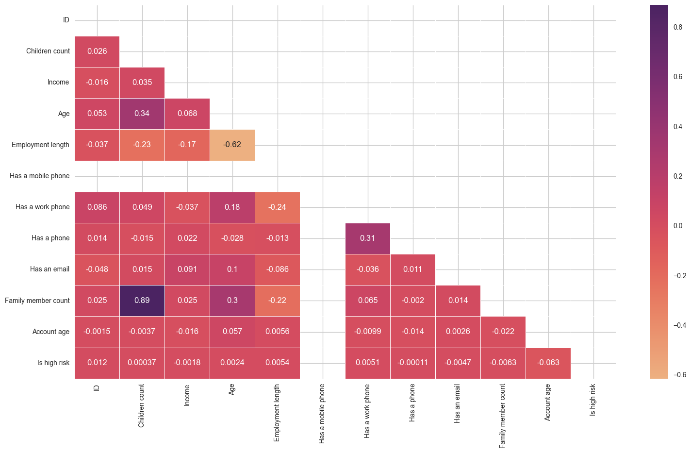
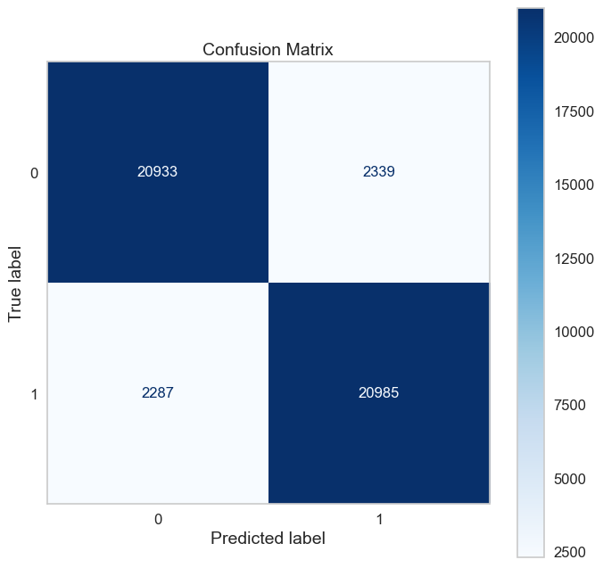
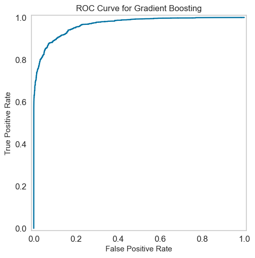

# Credit Card Approval Prediction


Banner [source](https://banner.godori.dev/)

## Key Findings

People with the highest income, and who have at least one partner, are more likely to be approved for a credit card.

## Authors

- [Manraj Singh](https://www.github.com/therealmanraj)

## Table of Contents

- [Key Findings](#key-findings)
- [Authors](#authors)
- [Table of Contents](#table-of-contents)
- [Business Problem](#business-problem)
- [Data Source](#data-source)
- [Methods](#methods)
- [Tech Stack](#tech-stack)
- [Metrics Used](#metrics-used-recall)
- [Run Locally](#run-locally-windows--macoslinux)
- [Explore the Notebook](#explore-the-notebook)
- [Repository Structure](#repository-structure)
- [Contribution](#contribution)
- [License](#license)

## Business Problem

This app predicts if an applicant will be approved for a credit card or not. Each time there is a hard enquiry, your credit score is affected negatively. This app predicts the probability of being approved without affecting your credit score. This app can be used by applicants who want to find out if they will be approved for a credit card without affecting their credit score.

## Data Source

- [Kaggle Credit Card Approval Prediction](https://www.kaggle.com/rikdifos/credit-card-approval-prediction)

## Methods

- Exploratory Data Analysis
- Bivariate Analysis
- Multivariate Correlation
- Model Deployment

## Tech Stack

- Python (refer to requirements.txt for the packages used in this project)

## Metrics Used: Recall

### Why Choose Recall as a Metric

Since the objective of this problem is to minimize the risk of credit default for financial institutions, the metric to use depends on the current economic situation:

- **Bull Market**: In a thriving economy, financial institutions may prioritize recall (sensitivity) to approve more applicants.
- **Bear Market**: During economic downturns, financial institutions may prioritize precision (specificity) to reduce the risk of defaults.

### Conclusion

Given the current economic conditions, we prioritize recall as our metric.

# Quick glance at the results

Correlation between the features.



Confusion matrix of gradrient boosting classifier.



ROC curve of gradrient boosting classifier.



Top 3 models (with default parameters)

| Model                  | Recall score |
| ---------------------- | ------------ |
| Support vector machine | 88%          |
| Gradient boosting      | 90%          |
| Adaboost               | 78%          |

**_The final model used is: Gradient boosting_**

## Lessons learned and recommendation

- Based on the analysis on this project, we found out that the education level and type of relationship are the most predictive features to determine if someone makes more or less than 50K. Other features like Capital gain, hours work and age are also usefull. The least usefull features are: their occupation and the workclass they belong to.
- Recommendation would be to focus more on the most predictive feature when looking at the applicant profile, and pay less attention on their occupation and workclass.

## Limitation and what can be improved

- Speed: since the model is stored on AWS S3, it can take some few seconds to load. Solution: cache the model with the Streamlit @st.experimental_singleton for faster reload.
- Dataset used: the dataset used is from 1990, inflation has not been taken into consideration and the countries's economies have changed since then. Solution: retrain with a more recent dataset.
- Hyperparameter tuning: I used RandomeSearchCV to save time but could be improved by couple of % with GridSearchCV.

## Run Locally (Windows & macOS/Linux)

### 1. Initialize Git

```bash
git init
```

### 2. Clone the Project

```bash
git clone https://github.com/therealmanraj/Credit-Card-Approval-Prediction
```

### 3. Enter the Project Directory

```bash
cd Credit-Card-Approval-Prediction
```

### 4. Create a Virtual Environment and Install Dependencies

#### Using Conda (Recommended)

- **macOS/Linux**:

```bash
conda env create --prefix ./env --file assets/environment.yml
```

- **Windows**:

```bash
conda env create --prefix .\env --file assets\environment.yml
```

#### Using venv (If Conda Is Not Available)

- **macOS/Linux**:

```bash
python3 -m venv env
source env/bin/activate
pip install -r requirements.txt
```

- **Windows**:

```bash
python -m venv env
.\env\Scripts\activate
pip install -r requirements.txt
```

### 5. Activate the Virtual Environment

#### Using Conda

- **macOS/Linux**:

```bash
conda activate ./env
```

- **Windows**:

```bash
conda activate .\env
```

#### Using venv

- **macOS/Linux**:

```bash
source env/bin/activate
```

- **Windows**:

```bash
.\env\Scripts\activate
```

### 6. List Installed Packages

```bash
conda list
```

OR, if using venv:

```bash
pip list
```

## Explore the Notebook

Explore the notebook file [here](https://nbviewer.org/github/therealmanraj/Credit-Card-Approval-Prediction/blob/main/notebooks/CCAP.ipynb)

## Contribution

Contributions are welcome! Please open a pull request or issue for any suggestions or improvements.

## License

This project is licensed under the MIT License. See `LICENSE` for details.
